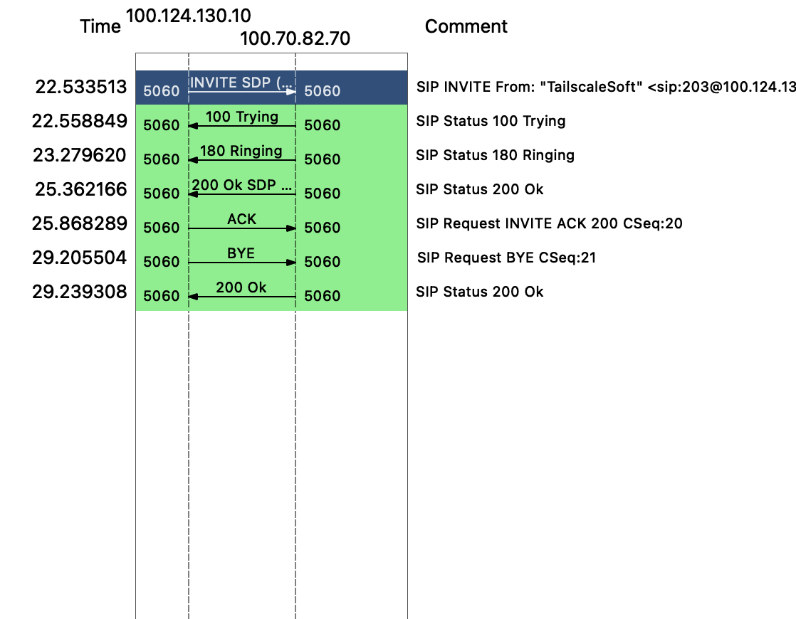

This is a *work in progress attempt* to make a simple VOIP (voice over IP) application that allows for ease-of-use and control on the packet-level of SIP requests.

The key parts are:
- ```SIP (session inition protocol)```: standard protocol to iniatiate/end a call
- ```RTP (real-time transport protocol)```: protocol to transport audio (or other) packets during a call
- simple GUI that allows for easy manipulation of SIP

## [Local SIP](localSIP/SIPapp.py)
I am currently trying to understand the basics of the SIP protocol, and reverse-engineer it to be able to answer, and hang up a call.



here is the basic structure of a call that must be re-implemented.